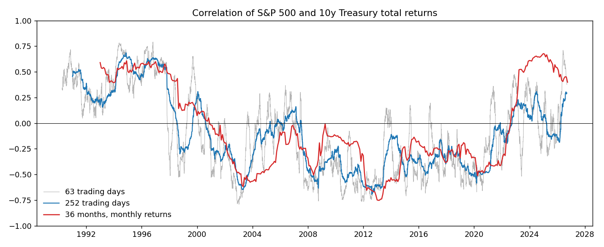
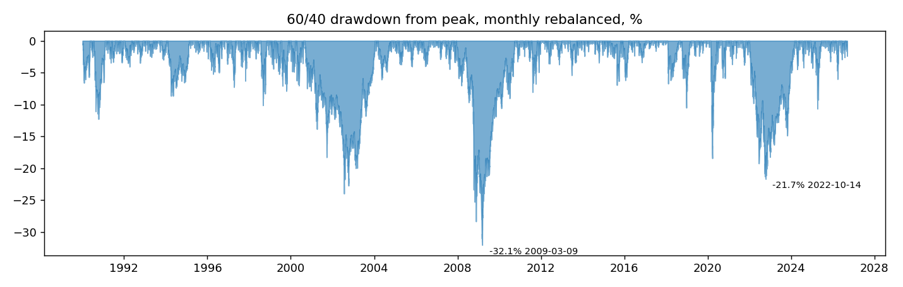
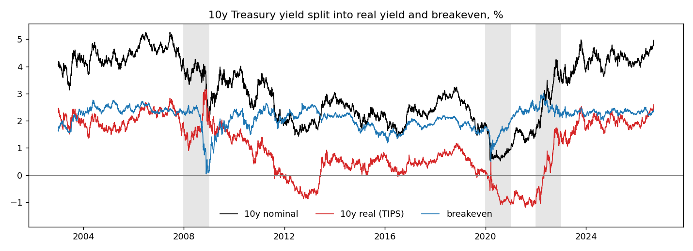
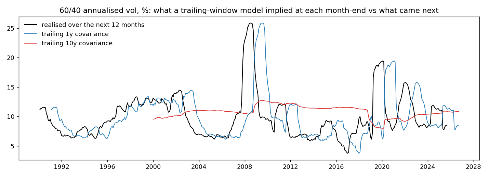
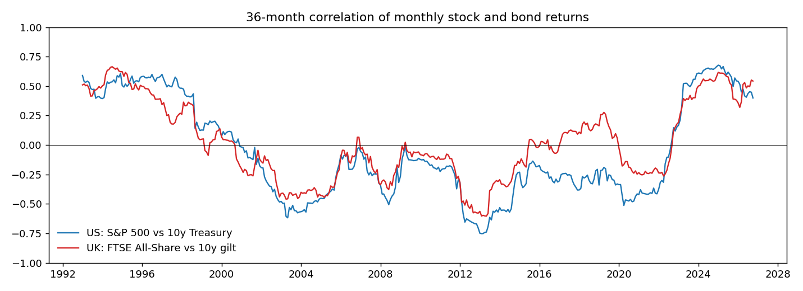
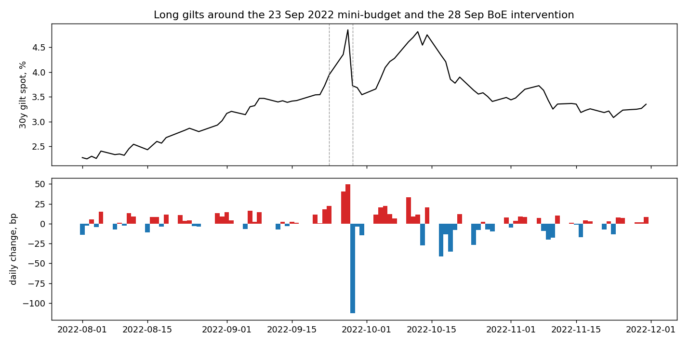

# stock-bond-corr

## Question

Since 1990, how much of a US 60/40 portfolio's risk has come from the correlation between stocks and bonds? What happened to that when the correlation turned positive in 2022, and what would a risk model built on trailing data have told an investor at the time? Then the same for the UK, including the gilt move in September 2022.

## Answer so far (as of 14 Sep 2026)

US first, UK at the end.

Using monthly returns, the S&P 500 and a 10y Treasury had a correlation of +0.35 in the 1990s, -0.34 over 2000-2020, +0.59 in 2022 and +0.47 since. In daily returns the same eras are +0.27, -0.38, +0.17 and +0.04. The 2022 flip is mostly a weeks-and-months thing: both assets were repricing the path of Fed rates, and day-to-day moves stayed largely unrelated. In 2000-2020 the daily, weekly and monthly numbers agree, which fits both assets reacting to growth news on the same day.

The flip was visible in a 63-day daily correlation from Feb 2021 and in a 252-day one from Nov 2021. A 36-month monthly correlation did not turn positive until Aug 2022.

**What it did to a 60/40** (S&P 500 / 10y Treasury, rebalanced monthly), splitting variance into an equity term, a bond term and the correlation term 2 x 0.6 x 0.4 x rho x s_e x s_b:

| window | corr (monthly) | correlation term, share of 60/40 variance | 60/40 vol | max drawdown |
|---|---|---|---|---|
| 2000-2020 | -0.34 | -24.8% | 8.6% | -32.1% (Mar 2009) |
| 2022 | +0.59 | +24.2% | 16.5% | -21.7% (14 Oct 2022) |
| 1994 | +0.73 | +33.2% | 8.3% | -8.7% |
| 1990s | +0.35 | +17.6% | 9.4% | -12.3% |

So the correlation term swung from taking about a quarter off 60/40 variance to adding about a quarter. Twelve monthly observations for 2022 is a small sample; on daily returns the same swing is -22% to +8%. The 2022 drawdown was smaller than 2008's because equity vol was 24% rather than 41%, not because bonds helped: they lost 16.5% that year.

Full tables: `results/decomposition_daily.csv`, `results/decomposition_monthly.csv`.

**Why 2022 was different: real yields, not inflation expectations.** Splitting the 10y yield into the TIPS real yield and the breakeven (2003 on):

| | 10y nominal | real | breakeven | equity corr with real (monthly) | with breakeven |
|---|---|---|---|---|---|
| 2022 | +225 bp | +255 bp | -30 bp | -0.82 | +0.59 |
| 2008 | -166 bp | +55 bp | -221 bp | -0.39 | +0.68 |
| 2020 | -95 bp | -114 bp | +19 bp | -0.63 | +0.84 |
| 2003-2020 | | | | -0.08 | +0.49 |

In 2008 and 2020 the bond rally came from falling breakevens or falling real yields, and equities fell with breakevens, which is the growth-shock pattern where bonds hedge. In 2022 the entire rise was real yields; breakevens ended lower. Equities and bonds both lost because the discount rate went up, and there was nothing for a bond to hedge.

**What a trailing-window risk model would have said.** At each month-end, 60/40 vol implied by the trailing 1y and 10y covariance of daily returns, against what was realised over the next 12 months:

At end 2021 the 10y model implied 9.2% vol with a -0.37 correlation (the 1y model: 8.0%, and its correlation had already drifted to -0.11). 2022 realised 15.7% with +0.17, a drawdown of 21%, a miss at the 92nd percentile of month-ends since 2000. Putting the realised 2022 vols into the model's assumed correlation gives 13.5%, so 2.2 of the 6.5 missed points came from the correlation flip and 4.3 from vol levels. End 2007 and end 2019 were bigger misses, but there the correlation came in more negative than assumed and helped; 2022 is the only one of the three year-ends where it hurt. Numbers in `results/risk_model_key_dates.csv`.

**The UK.** FTSE All-Share against a 10y gilt built from the Bank of England spot curve the same way, 1990 on. The UK never had the clean negative regime the US did: the 2000-2020 monthly correlation was -0.18 against -0.34, and it was back above zero by 2014-15. In 2022 it reached +0.79, with the correlation term 43% of UK 60/40 variance.

| | corr (monthly) | correlation term share | 60/40 vol | max drawdown | 60/40 return |
|---|---|---|---|---|---|
| UK 2000-2020 | -0.18 | -11.3% | 10.2% | -25.2% (Mar 2009) | |
| UK 2022 | +0.79 | +42.9% | 11.0% | -16.4% (12 Oct 2022) | -8.8% |
| US 2022 | +0.59 | +24.2% | 16.5% | -21.7% (14 Oct 2022) | -17.2% |

The UK 60/40 lost less in 2022 than the US one despite the worse correlation and gilts being more volatile than Treasuries (13.2% against 10.5%), because the FTSE All-Share was roughly flat on the year with 16.5% vol against the S&P 500's 24.2%. UK equity is price plus a flat 3.5% dividend accrual (Yahoo's UK adjusted closes are unusable; ISF.L's own distributions imply 3.85%); correlations don't depend on that, the return and drawdown do.

The 30y gilt in the week of the 23 Sep 2022 mini-budget: +18, +22, +41 and +50 bp on consecutive days (z-scores 2.7, 3.3, 6.0 and 6.8 against the trailing year), then -113 bp on 28 Sep when the Bank announced gilt purchases, the largest one-day move in the 25y series since 1980.

## How I got there

- Bond returns are built from the Treasury 10y par yield, 1990 onwards: each day the bond bought at par the day before is repriced at the par yield for its now slightly shorter maturity (`sbc/bonds.py`). Checked against IEF over 2002-2026: 33 bps a year ahead of the ETF, monthly return correlation 0.985. IEF's 15 bps fee is about half of that gap.
- Equity is the S&P 500 total return index from Yahoo.
- Gilt returns: Bank of England nominal spot curve, converted to a semiannual par yield at 7y and 10y, then the same repricing as the Treasuries (`sbc/uk.py`). Checked against IGLT.L rebuilt from price plus distributions: 28 bps a year ahead, monthly correlation 0.919 (a 10y/20y blend, closer to IGLT's duration, is 4 bps off at 0.956).
- Correlations in `sbc/regimes.py`, the 60/40 and its variance split in `sbc/portfolio.py`, the yield split and trailing-window forecasts in `sbc/risk.py`. `python -m sbc reproduce` rebuilds every number and figure above from the files hashed in `data/SNAPSHOT.md`; `python -m sbc fetch` refreshes them.
- The dated working notes, including the bugs, are in `notes/LOG.md`.

## Changelog

- 14 Sep 2026: repo created, question written down, data sources checked. Bond returns from yields, IEF check, first correlation figure. 60/40 variance split by era. Real vs breakeven split and the trailing-window risk model. UK leg from the Bank of England curve, Sep 2022 gilts.
